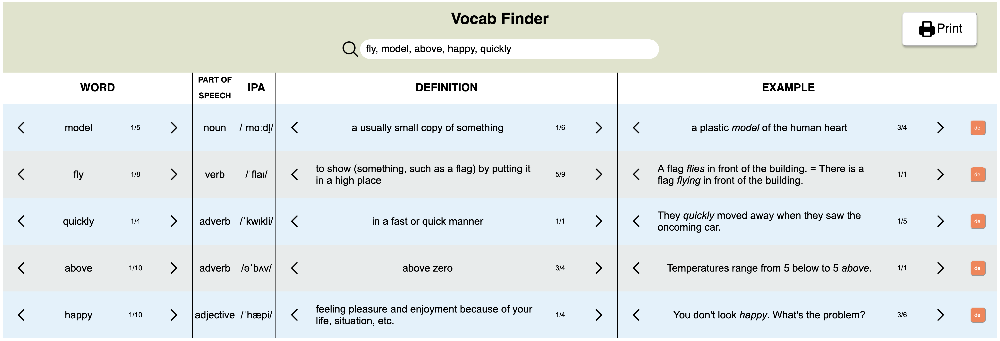

# Vocab Finder

## Overview
Vocab Finder is a specialized tool designed to streamline vocabulary research for ESL (English as a Second Language) teachers and students. It automates the process of looking up multiple words simultaneously, providing comprehensive word information from Merriam-Webster dictionary.

## Problem Statement
ESL teachers frequently need to:
- Research multiple vocabulary words quickly and accurately
- Create comprehensive vocabulary lists for students
- Prepare materials for test preparation
- Find detailed word information including definitions, parts of speech, and usage examples

Manual dictionary searches become time-consuming and inefficient when dealing with multiple words, especially when preparing for intensive language courses or test preparation classes.

## Benefits
### For Teachers
- Save time on vocabulary research
- Access accurate, consistent word information
- Quickly prepare vocabulary materials for lessons
- Generate properly formatted word lists efficiently

### For Students
- Access comprehensive vocabulary references
- Study from accurate, well-formatted word lists
- Better prepare for tests and examinations
- Build stronger vocabulary foundations

## Features
- Bulk word lookup capability
- Integration with Merriam-Webster dictionary
- Sortable results by different categories
- Print-friendly output
- Column sorting functionality

## How to Use
1. **Input**: Enter your list of words in the search bar, separated by commas
2. **Search**: Click enter to initiate the search
3. **Refine**: Use column arrows to sort and find specific information
4. **Select**: Choose the most relevant definitions and examples
5. **Print**: Generate a printer-friendly version of your vocabulary list

## Technical Details
- Data Source: Merriam-Webster Dictionary API
- Output Format: Printer-friendly layout
- Sorting: Available for all columns

## Future Improvements
- Export options (PDF, Word, Excel)
- Custom formatting templates
- Saved word lists
- Multiple dictionary source options

## Contact
[Your contact information or contribution guidelines here]